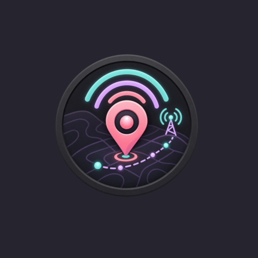

<p align="center">
  
</p>

# APRS-TX (Android)

Native Android port of [aprs-pwa](../aprs-pwa): send GPS beacons / status over **APRS-IS Tier2** (TCP port 14580).

The PWA uses a Cloudflare HTTP relay because browsers cannot open raw APRS-IS sockets. This app connects directly and picks a regional rotate hostname from the current GPS fix ([aprs2.net](https://www.aprs2.net/)):

| Region | Host |
|--------|------|
| North America | `noam.aprs2.net` |
| South America | `soam.aprs2.net` |
| Europe & Africa | `euro.aprs2.net` |
| Asia | `asia.aprs2.net` |
| Oceania | `aunz.aprs2.net` |
| Fallback / unknown | `rotate.aprs2.net` |

Each TX is a short-lived session: connect → `user … pass … vers APRS-TX 1.0 filter m/1` → send TNC2 packets → close (tries up to 3 DNS A records).

## Features

- Manual GPS fix + APRS-IS TX
- Scheduled beacons (interval ≥ 30s) via a **location foreground service**
- WiFi disconnect auto-start and reconnect auto-stop (auto-stop arms after 100s continuously disconnected when listening starts connected)
- Callsign / passcode validation, comment + status fields
- Settings + operation logs persisted locally; Settings JSON export/import for reinstall
- Auto power-save: back off GPS poll after repeated timeouts indoors
- Stop zones: configure up to 16 enabled zones with radius and notes; APRS TX is blocked while inside, and the Zone map shows them on a dark OpenStreetMap-based basemap

## Power / background design

| Choice | Why |
|--------|-----|
| Foreground service (`location`) | Reliable TX while screen off / app backgrounded |
| Single-shot GPS per TX | No continuous location listener |
| Reuse last fix if &lt; 60s old | Skip GPS wake when still fresh |
| Prefer last-known &lt; 30s | Avoid cold GPS when OS already has a fix |
| PARTIAL wake lock only around TX (≤60s) | CPU can sleep between beacons |
| Low-importance silent notification | Minimal user disturbance |

Build/install uses the `xianii/android-dev:latest` container image from [android-dev-docker](../android-dev-docker).

## Build

### Linux / WSL

Requires Docker and the `xianii/android-dev:latest` image.

```bash
./build.sh build          # assembleDebug in Docker
./build.sh release        # signed release; requires keystore/release.env
./build.sh test           # unit tests (packet format / validation)
./build.sh install        # adb install + launch (USB device)
./build.sh                # build + install
./build.sh adb devices
```

Override image: `ANDROID_DEV_IMAGE=android-dev ./build.sh build`

### Windows

Requires [WSLC](https://github.com/microsoft/WSL) available as `wslc.exe` on `PATH`, plus the `xianii/android-dev:latest` image already present in WSLC. Run the PowerShell script from the repository root; it does not require a host Gradle installation.

```powershell
.\build.ps1 build          # assembleDebug in WSLC
.\build.ps1 release        # signed release; requires keystore\release.env
.\build.ps1 test           # unit tests
.\build.ps1 install        # adb install + launch
.\build.ps1                # build + install
.\build.ps1 adb devices
```

Override image: `$env:ANDROID_DEV_IMAGE = "android-dev"; .\build.ps1 build`

## Package

- applicationId: `com.nigh.aprstx`
- minSdk 28 / targetSdk 35 / Compose + Kotlin 2.0

## License

GNU General Public License v3.0 — see [LICENSE](LICENSE).
