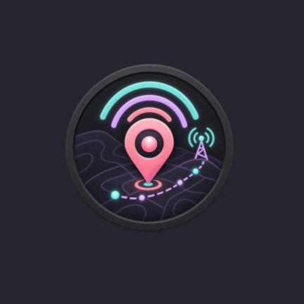

<p align="center">
  
</p>

# APRS-TX (Android)

Native Android port of [aprs-pwa](../aprs-pwa): send GPS beacons / status over **APRS-IS Tier2** (TCP port 14580).

The PWA uses a Cloudflare HTTP relay because browsers cannot open raw APRS-IS sockets. This app connects directly and picks a regional rotate hostname from the current GPS fix ([aprs2.net](https://www.aprs2.net/)):

| Region | Host |
|--------|------|
| North America | `noam.aprs2.net` |
| South America | `soam.aprs2.net` |
| Europe & Africa | `euro.aprs2.net` |
| Asia | `asia.aprs2.net` |
| Oceania | `aunz.aprs2.net` |
| Fallback / unknown | `rotate.aprs2.net` |

Each TX is a short-lived session: connect → `user … pass … vers APRS-TX 1.0 filter m/1` → send TNC2 packets → close (tries up to 3 DNS A records).

## Features

- Manual GPS fix + APRS-IS TX
- Scheduled beacons (interval ≥ 30s) via a **location foreground service**
- WiFi disconnect auto-start and reconnect auto-stop (auto-stop arms after 100s continuously disconnected when listening starts connected)
- Callsign / passcode validation, comment + status fields
- Settings + operation logs persisted locally; Settings JSON export/import for reinstall
- Auto power-save: back off GPS poll after repeated timeouts indoors
- Optional HTTPS webhook: report each manual attempt / scheduled GPS cycle, including positions where APRS TX is blocked
- Stop zones: configure up to 16 enabled zones with radius and notes; APRS TX is blocked while inside, and the Map shows them on a dark OpenStreetMap-based basemap

The home screen groups station details, location, and transmission controls. Home / Map / Settings are primary destinations in the bottom navigation; Logs stays in the home top bar. Map is available even without Stop zones. Switching tabs preserves page state and stops map GPS polling while away.
Scheduled TX shows its running state, next location check, and progress separately from Stop.

## Settings

Settings opens a grouped overview with current status for **Transmission**, **Automation**,
**Webhook**, **Stop zones**, and **Backup**. Open a category to edit it; valid changes save
automatically. Group headings and chevrons identify category links; a parent label above
the page title shows your current level. Category pages have a top-left back arrow; system Back returns to the overview, then Home. The overview has no back arrow. Entering and leaving a category use opposite slide
transitions, and returning preserves the overview scroll position.
Movement-based TX and webhook reveal their extra fields when enabled. JSON export/import
is under **Backup**. The repository link and author credit form a compact, centered footer.

Successful APRS Toast messages can be disabled in **Settings → Transmission** (default on).
Errors and cancellation messages remain visible; the foreground service notification stays active.
This preference is included in JSON backups; older backups default to on.

Install/run scripts update the app in place with `adb install -r -t` and preserve data,
including the authentication token. A signing-key mismatch fails without uninstalling.

## Webhook

**Copy token** copies a locally generated 256-bit random authentication token, even with
webhook disabled. Register it on your server and verify the exact header
`Authorization: Bearer <token>` on every report. It is sent only in this header, never
in the JSON body or logs. Clipboard previews are marked sensitive.

**Refresh token** asks for confirmation, saves a new token and copies it. Update the
server's accepted token before the next report, and revoke the old token on the server.
Refreshing does not itself contact the server. App updates, reporting-ID changes and
settings imports keep the token unchanged. It is excluded from JSON backups, Android
cloud backup and device transfer. Clearing app data or reinstalling requires registering
a new token. Token holders can submit requests; this scheme does not prevent replay.

In **Settings → Webhook**, enable the switch to reveal the configuration fields, then
enter your backend's **Webhook HTTPS URL** and a non-empty **Webhook reporting ID**. Settings are saved automatically and
included in JSON export/import; older backups default to webhook disabled. The reporting
ID is your own user identifier, independent of the APRS callsign. Both fields are trimmed
before use. The URL must use HTTPS with a valid certificate, without URL userinfo or a
fragment. Configure header-token validation on the backend instead of putting credentials
in the URL. Exported settings contain the URL, so keep those backups private.

Each **Send once** attempt and each scheduled GPS cycle sends one JSON POST when a
reliable location is available, **before** APRS cooldown, callsign validation, Stop zone,
or displacement/min/max interval checks. A cycle that enters a Stop zone reports its
position before stopping the schedule. A position packet and its optional APRS status
packet share one webhook report. Merely fetching GPS or viewing the map does not report;
a stopped schedule does not continue reporting.

Here, a reliable location means finite, in-range WGS84 coordinates with a fix age of
**0–60 seconds**. Old fallback fixes retain their original age and are not reported.
Horizontal accuracy is included when available, with no additional accuracy cutoff.
No reliable fix means no POST. Missing optional measurements are JSON `null`, not empty
strings; zero is a valid measurement. Speed can be supplied by GPS or estimated from two
recent fixes, as in the APRS path. Bearing is supplied by the location provider only.

Example request (`Content-Type: application/json; charset=utf-8`):

```json
{
  "id": "BA7NTM",
  "device_hash": "7e58cfa934b1d62e",
  "timestamp_ms": 1790726400000,
  "latitude": 22.5431,
  "longitude": 114.0579,
  "accuracy_m": 8.0,
  "speed_mps": 1.4,
  "bearing_deg": 90.0,
  "altitude_m": null
}
```

| Field | Type | Meaning |
|-------|------|---------|
| `id` | string | Required user-configured reporting ID |
| `device_hash` | string | Required first 16 lowercase hex characters of SHA-256 (64-bit device identifier) |
| `timestamp_ms` | integer | Fix time, Unix epoch milliseconds (not POST time) |
| `latitude` | number | Required WGS84 latitude, −90 to +90 degrees |
| `longitude` | number | Required WGS84 longitude, −180 to +180 degrees |
| `accuracy_m` | number or null | Horizontal accuracy radius in meters |
| `speed_mps` | number or null | Speed in meters per second |
| `bearing_deg` | number or null | Direction of travel clockwise from true north, [0, 360) degrees |
| `altitude_m` | number or null | [Altitude above the WGS84 ellipsoid](https://developer.android.com/reference/android/location/Location#getAltitude()) in meters; may be negative |

The hash is the first 16 hexadecimal characters of SHA-256 of `packageName|ANDROID_ID|manufacturer|model` encoded as UTF-8.
Raw device identifiers are not sent. Android scopes [`ANDROID_ID`](https://developer.android.com/reference/android/provider/Settings.Secure#ANDROID_ID) to device, Android user,
and app signing key; a factory reset or signing-key change can change it. If Android
provides no ID, a locally persisted random UUID replaces it. Device identity is not part
of the app's settings JSON, so importing the same settings onto another device does not
copy its hash. Use `(id, device_hash)` to distinguish a user's devices; the hash is an
identifier, **not authentication**. Servers upgrading from the old 64-character field
should migrate existing device records to the first 16 characters and accept the new
length; token authentication is independent of `(id, device_hash)`.

The backend should accept JSON POST and promptly return any **2xx** status (for example,
`204 No Content`). Response bodies are ignored. Redirects are not followed. Each report
is attempted once, with 5-second connect/read timeouts; there is no retry queue or offline
replay. Webhook completes before APRS rule evaluation, so a slow endpoint can delay that
attempt. HTTP errors and network failures appear in Logs and do not suppress APRS TX or
change its cooldown/track. No APRS passcode or raw APRS packet is sent to the webhook.

## Power / background design

| Choice | Why |
|--------|-----|
| Foreground service (`location`) | Reliable TX while screen off / app backgrounded |
| Single-shot GPS per TX | No continuous location listener |
| Reuse last fix if &lt; 60s old | Skip GPS wake when still fresh |
| Prefer last-known &lt; 30s | Avoid cold GPS when OS already has a fix |
| PARTIAL wake lock only around TX (≤60s) | CPU can sleep between beacons |
| Low-importance silent notification | Minimal user disturbance |

Build/install uses the `xianii/android-dev:latest` container image from [android-dev-docker](../android-dev-docker).

## Build

### Linux / WSL

Requires Docker and the `xianii/android-dev:latest` image.

```bash
./build.sh build          # assembleDebug in Docker
./build.sh release        # signed release; requires keystore/release.env
./build.sh test           # unit tests (packet format / validation)
./build.sh install        # adb install + launch (USB device)
./build.sh                # build + install
./build.sh adb devices
```

Override image: `ANDROID_DEV_IMAGE=android-dev ./build.sh build`

### Windows

Requires [WSLC](https://github.com/microsoft/WSL) available as `wslc.exe` on `PATH`, plus the `xianii/android-dev:latest` image already present in WSLC. Run the PowerShell script from the repository root; it does not require a host Gradle installation.

```powershell
.\build.ps1 build          # assembleDebug in WSLC
.\build.ps1 release        # signed release; requires keystore\release.env
.\build.ps1 test           # unit tests
.\build.ps1 install        # adb install + launch
.\build.ps1                # build + install
.\build.ps1 adb devices
```

Override image: `$env:ANDROID_DEV_IMAGE = "android-dev"; .\build.ps1 build`

## Package

- applicationId: `com.nigh.aprstx`
- minSdk 28 / targetSdk 35 / Compose + Kotlin 2.0

## License

GNU General Public License v3.0 — see [LICENSE](LICENSE).
